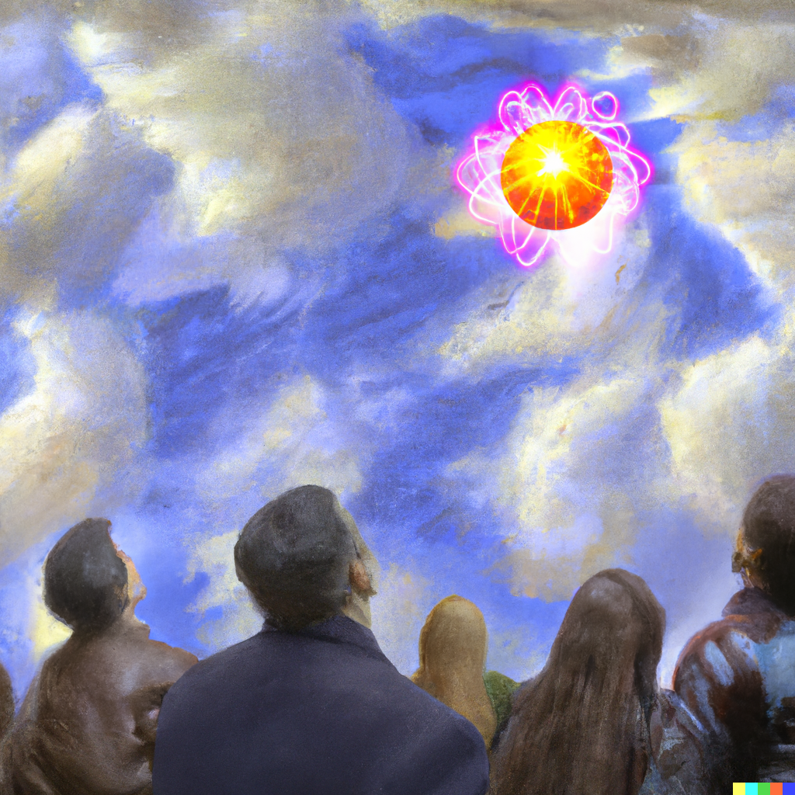

# Nakamoto consensus

This document will attempt to describe the theoretical aspect of new way to reach a consensus on the next step called Nakamoto consensus. As we'll see below, Nakamoto takes a slightly different and somewhat counterintuitive approach. We'll start by describing how voting works and follow with an explanation of its relation to energy. The goal is to understand that unlike the previous approach to consensus, we end up with an incredibly simple design where we reach consensus just by looking up at the sky and finding the largest energy ball. There's no need to communicate with anyone about the voting process and individual voting preferences, the only requirement is that we look at the same sky.

### Voting

It seems every consensus must have some kind of voting in it because at least one person must agree with an opinion to reach a consensus and an opinion is a form of a vote. Nakamoto consensus is no exception here and comes with the assumption that the majority of the citizens voting are honest. In the [previous article](consensus.md), the citizens were a resource that lived inside the system i.e. the coins. Who are the voting citizens in Nakamoto consensus? In Nakamoto, there are no predefined citizens. Rather than having these defined in advance, a voting citizen is a computation on one of the steps and the step on which the computation is made is their vote to march forward from. Since a general computation can be performed by anyone, this means that the set of potential voters is unbounded. To agree on the next step we'll take, we simply have to prove we collected roughly N votes to move forward and describe the next step we're going to make. 

### Proving collected votes

We mentioned a citizen vote is a computation. Let's assume the computations we're doing output a random sequence of bits which magically commits to a specific next step to take. Since the result is a random sequence of zeros and ones, we can define the rareness score for each vote by looking at the leading zeros. On average we will get 1 leading zero in 2 attempts, 2 zeros in 4 attempts, 4 zeros in 16 attempts, and so on. If we find a vote that is so rare that it must have taken roughly N votes to find it, then this can be used as proof that we did in fact make roughly N such computations, or in other words, we collected roughly N votes to continue from this step. Anyone can verify the output of this computation is a sequence of leading zeros and we know it couldn't have been gamed because the result of the computation is provably random. We can also verify the step the vote describes follows our rules. This proof is what we call a PoW (Proof of Work) which, once found, is shared with everyone else. We have solved how we collect and verify votes, but we have a slight issue. Since the number of computations one can perform is not limited, it seems we're prone to a [Sybil attack](https://en.wikipedia.org/wiki/Sybil_attack#:~:text=A%20Sybil%20attack%20is%20a%20type%20of%20attack%20on%20a%20computer%20network%20service%20in%20which%20an%20attacker%20subverts%20the%20service%27s%20reputation%20system%20by%20creating%20a%20large%20number%20of%20pseudonymous%20identities%20and%20uses%20them%20to%20gain%20a%20disproportionately%20large%20influence.) because we can create as many voting citizens as we like by running the computation on a step multiple times. There are more problems. Nothing prevents us from getting two different valid proofs the votes were collected that suggest a different step forward. Since both steps forward are valid and thus possible to make, we may come to a situation where people have a different view of reality. To have a consensus on a common reality, we have to find a way for everyone to agree on the same steps.

### Convergence to a common reality

How do we make people see the same reality? To solve this, we create the simplest rule possible which says "build on the step whose history has the most collected votes in total". Now even if we disagree for a moment on what the reality is, since voting citizen production won't be equally fast on these competing realities, one of them will have to get more votes than the other and people will eventually agree this is the reality to build on. It's a simple objective measure that solves the problem of diverging realities (or forks as they call them) by making everyone eventually converge on the same reality. This chance of divergence at the tip of the chain is the reason why we sometimes want to wait for the chain to make a few more steps so that we're sure the step we care about is not a part of the reality that will get replaced once we all converge. There could be financial incentives to secretly collect votes for a few sequential steps and later present a new reality that takes a different path. In the case of Bitcoin, this could potentially revert a transaction that was made and thus allow someone to double-spend some coins. This is why we need most of the votes to be honest by following the rule we specified. Luckily, there are incentives in place not to perform these kind of attacks. Someone being able to produce this many votes must have a specialized hardware whose only job is to create citizens that vote. It's in their best interest to keep the network running smoothly because if such an attack happened, the network would likely lose some of its value which would hurt their hardware investment and profits. If the majority of votes are honest, an adversary won't be able to get more votes to overtake the chain of steps by definition. Not only is this system still prone to Sybil attacks, Nakamoto is essentially consensus through a computational Sybil attack because we're creating ephemeral citizens that vote by performing these computations. It's an open competition where different realities compete in obtaining as many votes as they can.

This kind of consensus might seem like a relatively obscure and bad way to reach consensus, but it comes with some unique properties:
* **anyone can start doing computations and thus start voting** - This, at least in theory, makes it as inclusive as possible because you don't need to become a citizen to vote.
* **we don't communicate or have discussions about the next step**
* **there's no information about the voting details** - The proof the votes were collected is itself a single vote that doesn't tell anything about the other votes. Nobody can tell who voted, for what, or how many times, but we can prove all of us together collected the necessary votes. This proof is the only thing we need to communicate to others. Rather than showing a "who said what" proof through some statements made by specific identities (i.e. validators in PoS) we have a proof that doesn't really reveal much, it's just some computation data that represents a single vote.
* **no knowledge about consensus producers** - It doesn't need to know how many different parties/machines producing these voting citizens exist nor does it know their computing/voting power. In PoS we can usually see all the "machines" and their "computing power" because they're the validators and their stake.
* **no trust assumptions involving people** - A user doesn't need to trust other users with their statements. They simply trust the voting proof which, as we'll see below, is equivalent to trusting the energy being spent rather than people making statements.

Everything in Nakamoto consensus is achieved purely through independent computations without interaction. This asocial way of voting may be what makes it more resilient than other consensus mechanisms because you can't capture the citizens. Even if you manage to stop the majority of the vote producers, new ones could just as easily get spun up. Once the PoW (rare vote) is found, the proof simply appears in the sky where anyone can see it and decide whether they take it as a part of reality or not. The fact that parties don't communicate and that the citizens are undefined allows us to add/remove vote-producing machines (often specialized computers) on the fly.

### How many votes do we need to collect?

We still haven't discussed how we decide what the number of required votes for the next step is. If this number was a constant, we could have a problem of either making a step faster than we could propagate it along the network or too slow. For this reason, Bitcoin balances this with a difficulty adjustment algorithm whose job is to check if we're doing steps too slow or too fast and adjust the required number of votes accordingly. Bitcoin specifically targets the steps to be approximately 10 minutes apart. This sounds like a long time, but it's much faster and easier to transfer than gold. It also makes very little difference if the time was 15 seconds or 10 minutes as this doesn't really impact the throughput of the system, but we'll leave this as an exercise for the reader to figure out why.

### From voting to energy balls and security

Every vote we print is a computation and every computation takes some time and energy to perform. Since Nakamoto voting is a computational Sybil attack, this means we're using energy proportionally to the extent of the Sybil attack. The proof of collected votes thus also proves energy was spent meaning every step we agreed on required a certain amount of energy. One way to visualize this is to think of these proofs as balls of energy that can be joined together to form a larger energy ball in a similar way two water droplets can be combined. The reality is then defined as the largest energy ball we see in the sky. The most important part is that the energy transmitted into a new step protects all the previous steps meaning we're continuously adding security to the past steps. And this never stops. If an attacker wanted to revert a transaction that was done in a step that happened a year ago, they would need to create more than a year of energy to revert that step and change the course of action which sounds near impossible. Even if such an attack happened, the attack would replace an existing energy ball with a larger one. This means you'd need even more energy to perform the same attack on these steps again and even more than before for the previous steps. The reality and the past continuously keeps hardening and can always make progress because you can always direct energy to make a new step.

### Verification of common reality

Any person can look up at the sky and find the largest energy ball. This is their reality. There's no need to communicate with anyone as long as people are looking at the same sky. The sky here is P2P communication of (PoW, step) pairs and not communication on how these came to existence. If this communication graph gets disconnected into two different (disconnected) graphs A and B, people in A will be looking at a different sky than those in B and thus will see different energy balls and have a different view of reality. This can go on for some time, but once the two skies get connected, there will be only a single objective reality which is the largest energy ball in the joint sky. As mentioned, there are no trust assumptions involving people, we instead trust the energy we see.

### Summary

We managed to reach consensus on the next step without needing to publicly share our opinion about the step or having to trust other people regarding statements about steps. We simply look in the sky and a bigger energy ball appears that describes the step. This approach is simpler and more resilient, but it introduces the concept of probabilistic finality of the step where we can never really know with 100% certainty that the reality we look at is the real one. This probability however becomes exceedingly small as time passes. I think both approaches to consensus are valuable in their own ways because they have different properties, but we may want to have the most resilient variant for a global store of value.

**It doesn't seem that PoS makes PoW obsolete. Keep calm and look up.**

